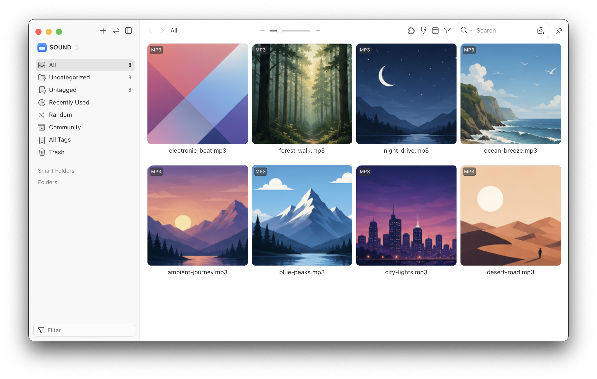
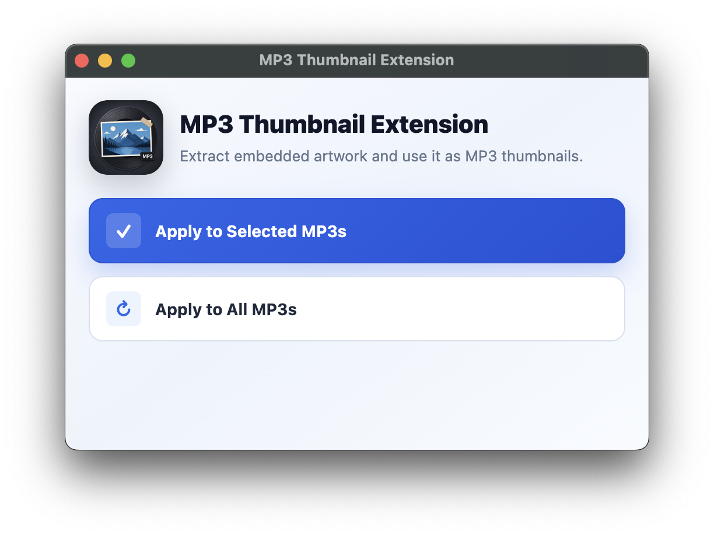

# Eagle | MP3 Thumbnail Extension

An Eagle Plugin that uses embedded MP3 artwork as thumbnails and backfills metadata such as duration and BPM.



Manual backfill:



## Features

- Use embedded MP3 artwork as thumbnails
- Apply thumbnails when MP3 files are imported
- Backfill thumbnails for selected MP3 items
- Backfill thumbnails for all MP3 items in the current library
- Extract duration from MPEG audio frames
- Extract BPM from `TBPM`, `TBP`, `TXXX:BPM`, and `TXXX:Tempo`

## Requirements

- Eagle 4.0 Build 23 or later
- MP3 files with embedded ID3 artwork

## Usage

- `Apply to Selected MP3s`: Updates only the currently selected MP3 items.
- `Apply to All MP3s`: Updates every MP3 item in the current library.

For existing libraries, test `Apply to Selected MP3s` on a few files first. If the result looks correct, run `Apply to All MP3s`.

## Metadata Updates

For existing Eagle items, this plugin updates each item's `metadata.json` with values like:

```json
{
  "duration": 1217.664,
  "bpm": 135.837,
  "customThumbnail": true
}
```

Only `duration`, `bpm`, and `customThumbnail` are updated. Existing metadata fields are preserved. `duration` and `bpm` are written only when they can be detected; `customThumbnail` is written when artwork thumbnail assignment succeeds.

> [!NOTE]
> Eagle's official guidance recommends using the Item API instead of editing files under the Eagle resource library. Duration and BPM are not exposed as writable Item API properties, so this plugin writes only these limited fields directly to `metadata.json`.

## Limitations

- Eagle already has native MP3 waveform thumbnails. Import-time format extension behavior may depend on Eagle's internal format priority.
- Already-imported MP3 items may not be refreshed by Eagle's thumbnail refresh command. Use the plugin window backfill actions instead.
- BPM is only available when the source MP3 contains a supported BPM tag.
- Supports common ID3 artwork and metadata patterns.

> [!NOTE]
> If thumbnails appear gray, try restarting Eagle to make them display in color.
> Inspector previews for MP3 files may remain gray due to Eagle's built-in MP3 handling.
